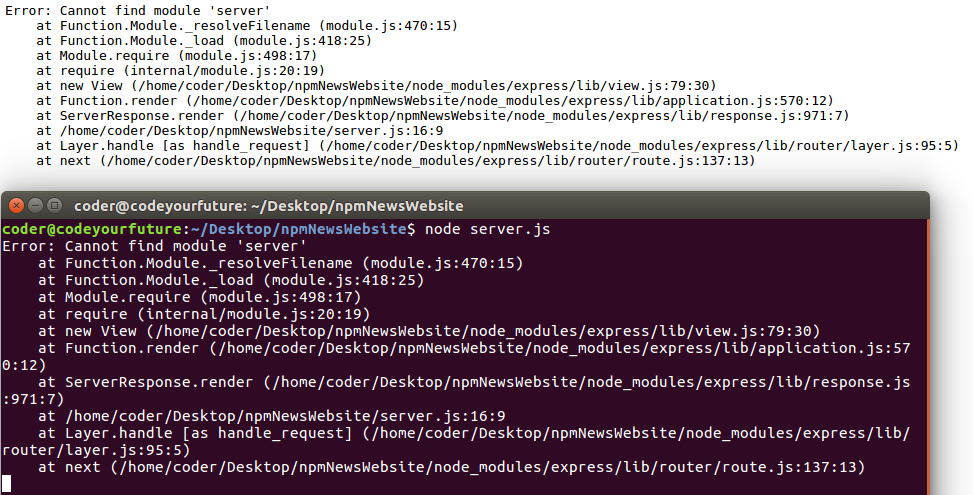

# NewsNodeJs
1-create backage 

npm init
--------------------------------------------
2-add libraries

install express
npm install express --save

install formidable
npm install express-formidable --save

install express holderbars
npm install express-holderbars --save

install ajax xmlhttp request
npm instal xmlhttprequest --save

-------------------------------------------
3-create new file 

touch server.js 
---------------------------------------------------------------------------------------------

4- start generate the server andd require the libraries and frame works we had add 

create express server
const express = require("express");

use the server 
const app = express();

reuire formidable
const formidable = require("express-formidable");

require file system
const fs = require('fs');

require holderbars
const exphbs = require('express-handlebars');

require xmlhttp request
const XMLHttpRequest = require("xmlhttprequest").XMLHttpRequest;

generate handlebars exgine with default layout is main
app.engine('handlebars', exphbs({ defaultLayout: 'main' }));

activate the engine
app.set('view engine', 'handlebars');

this will allow server to access files js css images ... express static
app.use(express.static('public'));

need to activative formidable // Note we should add it after express.static
app.use(formidable());

//server will work in port 3000
app.listen(3000);

-----------------------------------------------------------------------------------------------

now we need to create handlebars pages so we will create view folder inside it we will create one folder layour and 6 handlebars pages
wolrd.handlebars uk.handlebars  usa.handlebars  eco.handlebars  tec.handlebars sport.handlebars 
and inside layout folder we will create the default handleabars it name is main.handlebars
because we have generate the main default page is main code is 
app.engine('handlebars', exphbs({ defaultLayout: 'main' }));

------------------------------------------------------------------------------------------------

for now we need to check our work so we need to start work in main handlebars for now we will add a test page to test our page ,
so now we will go to html page and add these codes

<!Docype html>
<head>
        <title></title>
 </head>  

<body>
        <header>Here there is header</header>
        {{{body}}}
        <footer>Here there is footer<footer>
</body>

now we need to create another file name index inside viw folder to make it the main page.

we created it index.handlebars inside it we add this code <h1>Is Our Work Right till now !!</h1>

for now it should give us this result 

hello I am header
Is Our Work Right till now
Here there is footer

two line from default bage and the body from index handlebars

but before that we need to set the route and render the page so we need to add some code

app.get('/', function(req, res) {

})

and inside it 

app.get('/', function(req, res) {
	res.render('index.server')
})

now we are done we will add check if it's work 

not Work !! We get Error 

 

Now I will try to solve the error

-------------------------------------------------------------------------------

html main not work right 

I will look where is the mistake 

<!Doctype html>
We find 2 erors 
1 we have mistake in <!Doctype html> and fotter tag not close 

the page work we will test the server again 

I Fint the error 
in this line       res.render('index.server')

index.server ? it should be just index like this  res.render('index')

------------------------------------------------------------------------------------

now we need to make nav bar for 5 pages just add some elements 
we will not make real nav its just for text 

so we will add 5 element in main page than we will put different contant to each page add route to them and render them

I added this nav bar 

<ul style="display:flex;">
                <li><a href="/world">World news</a></li>
                <li><a href="/uk">Uk News</a></li>
                <li><a href="/usa">Usa News</a></li>
                <li><a href="/eco">Economic News</a></li>
                <li><a href="/sport">Sport News</a></li>
                <li><a href="/tec">Tec News</a></li>
        </ul>

and I created routes and render the handlebars to this routes and ever thing work right

------------------------------------------------------------------------------------------
Now I want to add my Front End codes I had created before its some sliders 
and I want to make a two slider to each Page then I will start to add API Ajax requests

We added now navbar to all pages and we test them now I will add sliders to all pages and other content
----------------------------------------------------------------- 
 

